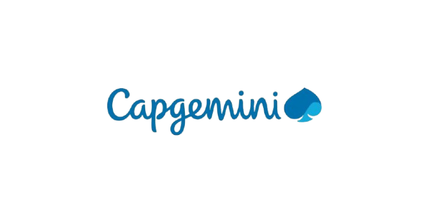

# 🚀 Cap WorkSpace - Plateforme de Génération de Projets IA

[](https://nextjs.org/)
[](https://www.typescriptlang.org/)
[](https://firebase.google.com/)
[](LICENSE)

Une plateforme intelligente de génération automatique de projets web alimentée par l'IA, développée par l'équipe de l'EMSI Marrakech pour Capgemini.



## 📋 À propos

**Cap WorkSpace** révolutionne la création de projets web en transformant une simple description en un projet complet et fonctionnel grâce à l'intelligence artificielle. La plateforme génère automatiquement l'architecture, le code source, la documentation technique et gère même le déploiement.

## ✨ Fonctionnalités Principales

- 🤖 **Génération IA Intelligente** - Agents IA spécialisés pour chaque étape
- 🎨 **Interface Moderne** - Dashboard interactif avec éditeur Monaco intégré
- 📊 **Diagrammes UML** - Génération automatique de 5 types de diagrammes
- 💬 **Chatbot IA** - Assistant intelligent pour modifications en temps réel
- 🚀 **Déploiement Automatique** - Intégration GitHub et Netlify
- 🔐 **Authentification Sécurisée** - Contrôle d'accès Firebase

## 🛠️ Technologies

### Frontend
- **Next.js 15** - Framework React avec App Router
- **TypeScript** - Typage statique
- **Tailwind CSS** - Styling moderne
- **Shadcn/ui** - Composants UI réutilisables
- **Monaco Editor** - Éditeur de code professionnel

### Backend & Services
- **Firebase** - Authentication & Firestore Database
- **Claude AI (Anthropic)** - Intelligence artificielle
- **GitHub API** - Gestion des dépôts
- **Netlify API** - Déploiement automatique

### Architecture
- **Multi-agents IA** - Système d'agents spécialisés
- **PlantUML & Mermaid** - Génération de diagrammes
- **Jest & React Testing Library** - Tests automatisés

## 🚀 Installation

### Prérequis
- Node.js 18+ 
- npm ou yarn
- Compte Firebase
- Clé API Claude (Anthropic)

### Étapes d'installation

1. **Cloner le repository**
```bash
git clone https://github.com/hassaneGuedad/tp_pfa.git
cd tp_pfa/project
```

2. **Installer les dépendances**
```bash
npm install
```

3. **Configuration des variables d'environnement**

Créez un fichier `.env.local` dans le dossier `project/` :

```env
# Firebase Configuration
NEXT_PUBLIC_FIREBASE_API_KEY=your_firebase_api_key
NEXT_PUBLIC_FIREBASE_AUTH_DOMAIN=your-project.firebaseapp.com
NEXT_PUBLIC_FIREBASE_PROJECT_ID=your-project-id
NEXT_PUBLIC_FIREBASE_STORAGE_BUCKET=your-project.firebasestorage.app
NEXT_PUBLIC_FIREBASE_MESSAGING_SENDER_ID=your_sender_id
NEXT_PUBLIC_FIREBASE_APP_ID=your_app_id
NEXT_PUBLIC_FIREBASE_MEASUREMENT_ID=your_measurement_id

# Anthropic Claude API Key (OBLIGATOIRE)
CLAUDE_API_KEY=your_claude_api_key_here

# Netlify Configuration (optionnel)
NETLIFY_ACCESS_TOKEN=your_netlify_token_here
```

4. **Lancer le serveur de développement**
```bash
npm run dev
```

Ouvrez [http://localhost:3000](http://localhost:3000) dans votre navigateur.

## 📖 Documentation

Pour plus d'informations détaillées :

- 📄 [Documentation complète](project/README.md)
- ⚙️ [Guide de configuration](project/SETUP.md)
- 🧪 [Guide des tests](project/TESTING.md)

## 🏗️ Structure du Projet

```
tp_pfa/
├── project/                    # Application principale
│   ├── app/                   # Pages et routes Next.js
│   ├── components/            # Composants React réutilisables
│   ├── agents/                # Agents IA spécialisés
│   ├── lib/                   # Utilitaires et helpers
│   ├── services/              # Services API
│   ├── types/                 # Définitions TypeScript
│   └── public/                # Assets statiques
├── .gitignore                 # Fichiers ignorés par Git
└── README.md                  # Ce fichier
```

## 🤝 Contribution

Les contributions sont les bienvenues ! N'hésitez pas à :

1. Fork le projet
2. Créer une branche (`git checkout -b feature/AmazingFeature`)
3. Commit vos changements (`git commit -m 'Add: Amazing Feature'`)
4. Push vers la branche (`git push origin feature/AmazingFeature`)
5. Ouvrir une Pull Request

## 👥 Équipe

Développé par l'équipe EMSI Marrakech pour **Capgemini**

## 📄 Licence

Ce projet est sous licence MIT. Voir le fichier [LICENSE](LICENSE) pour plus de détails.

## 🔗 Liens Utiles

- [Documentation Next.js](https://nextjs.org/docs)
- [Firebase Documentation](https://firebase.google.com/docs)
- [Anthropic Claude API](https://docs.anthropic.com/)
- [Tailwind CSS](https://tailwindcss.com/docs)

## ⚠️ Sécurité

**Important :** Ne jamais committer les fichiers `.env` ou `.env.local` contenant vos clés API. Utilisez toujours le fichier `.gitignore` pour les protéger.

---

<p align="center">
  Fait avec ❤️ par l'équipe EMSI Marrakech
</p>
